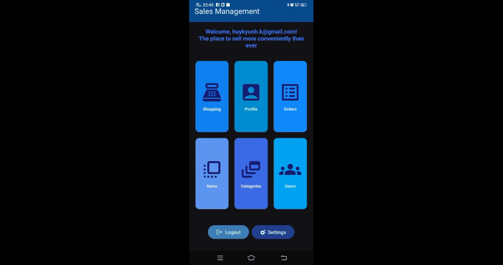

# Sales Management Mobile App Firebase 

An Android application designed for efficient sales and product management, offering distinct functionalities for both administrators and regular users. This app streamlines inventory, order processing, and user interactions within a sales ecosystem.
## Visualization.
<p align="center">
  
  
  
  
    
  
  
  
  
</p>

## 🌟 Features.

* **User Authentication:** Secure login/logout with Firebase Authentication (Email/Password & Google Sign-In).
* **Role-Based Access Control:**
    * **Admin Users:** Full access to manage products, categories, users, and view all orders.
    * **Regular Users:** Browse products, add items to cart, place orders, and view their order history.
* **Product Management:**
    * View a comprehensive list of products.
    * (Admin) Add, edit, and delete products.
* **Category Management:**
    * View product categories.
    * (Admin) Add, edit, and delete categories to organize products.
* **Shopping Cart System:** (For Regular Users)
    * Add products to a dynamic shopping cart.
    * Manage quantities and remove items from the cart.
    * Proceed to checkout for order placement.
* **Order Management:**
    * (Admin) View and manage all placed orders.
    * (Regular User) View personal order history.
* **User Profile Management:** Users can view and potentially update their profile information.
* **Settings:** Customize app preferences, including theme (light/dark/system default) and notification settings.
* **Firebase Cloud Messaging (FCM):** Integrated for push notifications, allowing users to opt-in/out of updates.
* **Intuitive UI/UX:** Built with Material Design components for a modern and user-friendly interface.
* **Gesture Navigation:** Swipe gesture to quickly access the Sales Activity for regular users.

## 🛠️ Technologies Used

* **Language:** Java
* **Platform:** Android
* **Backend:** Google Firebase
    * **Firebase Authentication:** For user sign-up, sign-in, and session management.
    * **Cloud Firestore:** NoSQL database for storing product, category, user, and order data.
    * **Firebase Cloud Messaging (FCM):** For push notifications.
* **UI Components:** AndroidX, Material Design Components.

## 🚀 Getting Started

To get a local copy up and running, follow these simple steps.

### Prerequisites

* Android Studio Arctic Fox or newer
* Java Development Kit (JDK) 11 or newer
* A Google Firebase Project (set up for Android)

### Installation

1.  **Clone the repository:**
    ```
    git clone [https://github.com/hkhuang07/Sales-Management-Mobile-App-Firebase.git](https://github.com/hkhuang07/Sales-Management-Mobile-App-Firebase.git)
    ```
2.  **Open in Android Studio:**
    Open the cloned project folder in Android Studio.
3.  **Set up Firebase:**
    * Go to the [Firebase Console](https://console.firebase.google.com/).
    * Create a new Firebase project (if you don't have one).
    * Add an Android app to your Firebase project.
    * Follow the instructions to download your `google-services.json` file.
    * Place `google-services.json` into your `app/` directory of the Android Studio project.
    * Enable **Authentication** (Email/Password and Google Sign-in) and **Cloud Firestore** in your Firebase project.
    * Set up **Firestore Security Rules** appropriately for your app's data access. (Example rules should be added here for basic functionality if you have them, otherwise, advise the user to set them up for security).
    * Enable **Cloud Messaging** for push notifications.
4.  **Sync Gradle:**
    Allow Android Studio to sync the project with Gradle files to download all necessary dependencies.
5.  **Run the app:**
    Connect an Android device or use an emulator, then click the "Run" button in Android Studio.

## 📂 Project Structure (Key Files)

* `app/src/main/java/com/example/salesmanagement/MainActivity.java`: The main entry point and dashboard of the application, handling user roles and navigation.
* `app/src/main/java/com/example/salesmanagement/LoginActivity.java`: Manages user authentication.
* `app/src/main/java/com/example/salesmanagement/ItemsListActivity.java`: Displays and manages product listings.
* `app/src/main/java/com/example/salesmanagement/CategoriesListActivity.java`: Handles category management (admin only).
* `app/src/main/java/com/example/salesmanagement/SalesActivity.java`: Provides the product Browse and purchasing interface for regular users.
* `app/src/main/java/com.example/salesmanagement/CartsActivity.java`: Manages the user's shopping cart.
* `app/src/main/java/com.example/salesmanagement/OrdersListActivity.java`: Displays all orders (admin only).
* `app/src/main/java/com.example/salesmanagement/OrderHistoryActivity.java`: Shows a regular user's order history.
* `app/src/main/java/com.example/salesmanagement/UserProfileActivity.java`: User profile viewing/editing.
* `app/src/main/java/com.example/salesmanagement/SettingsActivity.java`: App settings, including theme and notification preferences.
* `app/src/main/java/com.example/salesmanagement/MyFirebaseMessagingService.java`: Handles incoming FCM notifications.
* `app/src/main/res/layout/`: Contains all XML layout files for the activities and fragments.
* `app/src/main/res/xml/root_preferences.xml`: XML file defining the preferences screen.
* `app/google-services.json`: Firebase configuration file.

## 🤝 Contributing

Contributions are what make the open-source community such an amazing place to learn, inspire, and create. Any contributions you make are **greatly appreciated**.

If you have a suggestion that would make this better, please fork the repo and create a pull request. You can also simply open an issue with the tag "enhancement".
Don't forget to give the project a star! Thanks again!

1.  Fork the Project
2.  Create your Feature Branch (`git checkout -b feature/AmazingFeature`)
3.  Commit your Changes (`git commit -m 'Add some AmazingFeature'`)
4.  Push to the Branch (`git push origin feature/AmazingFeature`)
5.  Open a Pull Request

## ⚖️ License

Distributed under the MIT License. See `LICENSE` for more information.

## 📞 Contact

Huynh Quoc Huy - [huykyunh.k@gmail.com (Optional)] - [https://github.com/hkhuang07/]

Project Link: [https://github.com/hkhuang07/Sales-Management-Mobile-App-Firebase](https://github.com/hkhuang07/Sales-Management-Mobile-App-Firebase)

---

